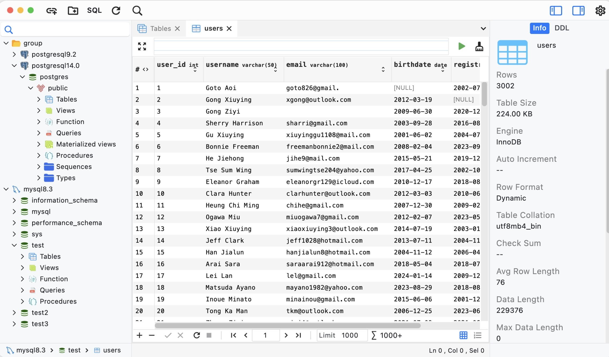
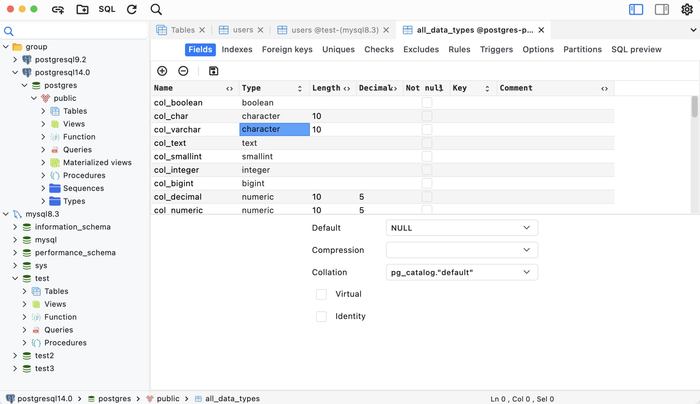
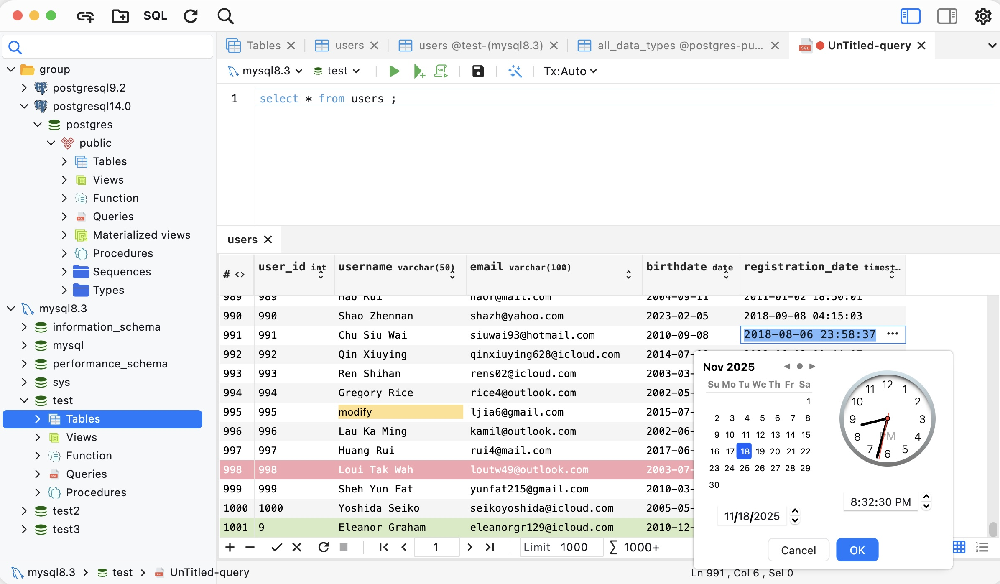
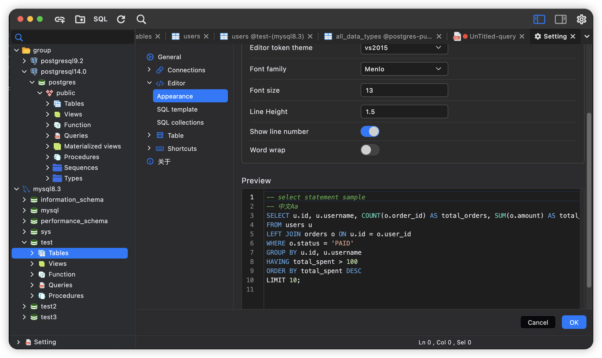

# Dbable

[简体中文](README_CN.md) | English

## About

Dbable is a modern cross-platform database management software designed for developers and database administrators. Now available on `Windows`, `Mac`, and `Linux`.

## Screenshots

## Features

**1. Object Designer**

Manage common database objects efficiently.

**2. Data Editor**

Insert, edit, delete, copy, or paste data records into the data editor. Supports editing query results.

**3. Code Completion**

Complete keywords, functions, databases, tables, fields, and aliases for faster coding.

**4. Code Snippets**

Manage frequently used code snippets for improved productivity.

**5. Import/Export**

Supports importing and exporting files in csv, json, SQL, txt, and xml formats.

**6. Custom App Style**

Personalize the application interface to match your preferences.
